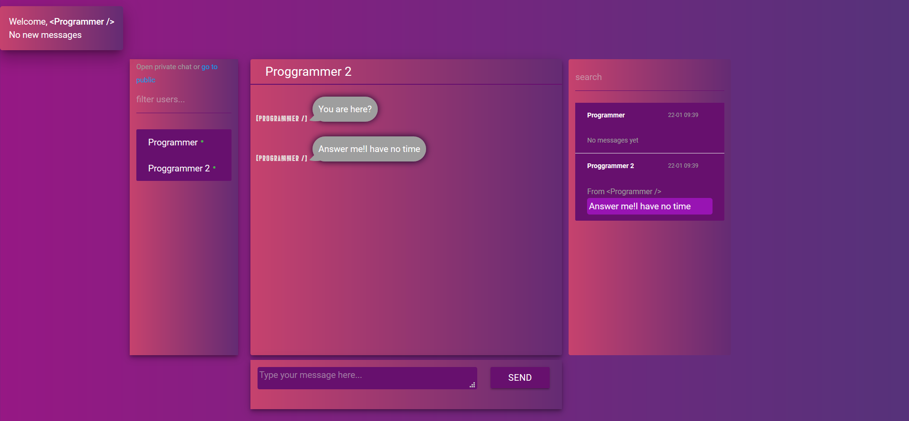

<<<<<<< HEAD
# MyChatApp

This project was generated with [Angular CLI](https://github.com/angular/angular-cli) version 1.6.3.

## Development server

Run `ng serve` for a dev server. Navigate to `http://localhost:4200/`. The app will automatically reload if you change any of the source files.

## Code scaffolding

Run `ng generate component component-name` to generate a new component. You can also use `ng generate directive|pipe|service|class|guard|interface|enum|module`.

## Build

Run `ng build` to build the project. The build artifacts will be stored in the `dist/` directory. Use the `-prod` flag for a production build.

## Running unit tests

Run `ng test` to execute the unit tests via [Karma](https://karma-runner.github.io).

## Running end-to-end tests

Run `ng e2e` to execute the end-to-end tests via [Protractor](http://www.protractortest.org/).

## Further help

To get more help on the Angular CLI use `ng help` or go check out the [Angular CLI README](https://github.com/angular/angular-cli/blob/master/README.md).
=======
# ng-cosmic-chat
Chat application built with angular 5,Nodejs,RxJs and Websockets.

Live demo coming soon...

Authorization view:

Once authorized, user enters the public chat room, where he can send messages and any other user can see it.
On the left side of the interface is the list of users. Green circle next to nickname indicates that the user is currently online. Once user disconnects this circle is no longer displayed.

If user wants to chat with others privately, he can click on any nickname from userlist and new room will be created for those two.
Chat has a "read-unread" messages feature. If the user on the other end hasn't read the messages yet, those messages are rendered in gray color,in other case the color is purple.

When user gets messages from other users or reads them in private threads, his unread messages counter increments and decrements correspondingly.

Chat as well is equipped with sounds of incoming and outgoing messages.

Operations with messages, threads and users are performed with the help of RxJs library.

Enjoy!
>>>>>>> ba3f1e89addf4bc93854bb9260c9b1bb0bb69a57
