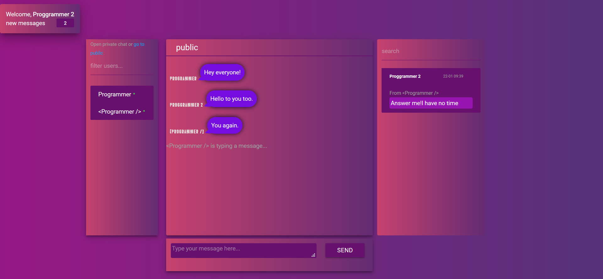

# ng-cosmic-chat
Chat application built with angular 5,Nodejs,RxJs and Websockets.

Live demo coming soon...

Authorization view:

Once authorized, user enters the public chat room, where he can send messages and any other user can see it.
On the left side of the interface is the list of users. Green circle next to nickname indicates that the user is currently online. Once user disconnects this circle is no longer displayed.

If user wants to chat with others privately, he can click on any nickname from userlist and new room will be created for those two.
Chat has a "read-unread" messages feature. If the user on the other end hasn't read the messages yet, those messages are rendered in gray color,in other case the color is purple.

When user gets messages from other users or reads them in private threads, his unread messages counter increments and decrements correspondingly.

Chat as well is equipped with sounds of incoming and outgoing messages.

Operations with messages, threads and users are performed with the help of RxJs library.

Enjoy!
